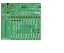
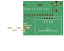

# led-controller-pcb

A PCB to control LEDs (up to 5 channels) using PWM, based on an Espressif ESP32-C6 development board.

Do you want to control your LEDs through Wi-Fi, Bluetooth or Zigbee, but you don't have 100€ lying around? This project is for you!
## Images

 

## Features

- 5 PWM **output channels**
- 5 **switch MOSFETS** (up to 8A)
- VIN **up to 28V**
- ESP32-C6 controllable through **USB, Wi-Fi, Bluetooth 5 (LE), IEEE 802.15.4**
- Support for RGB, RGBW, RGBWW/CW, WS2812B, and other configurations
- Control through MQTT, HomeAssistant
- Fully open-source software and hardware
- 6.25 × 5 cm
- Not battle tested, so might stop working randomly

## Software

You can write your software using any framework you prefer. This board is built and will work out of the box for the [kongr45gpen/ledstripesp32](https://github.com/kongr45gpen/ledstripesp32) project specifically.

## Bill of Materials

This board is meant to function as a **controller** (generating low-power PWM signals from a network/wired input), as a **dimmer** (switching high-power LED lights on/off based on the input signal) or both.

The **controller** function is based on the [ESP32-C6-DevKitC-1](https://docs.espressif.com/projects/espressif-esp-dev-kits/en/latest/esp32c6/esp32-c6-devkitc-1/index.html) development board, but other ESP32 development boards should be also usable (not tested).

The **dimmer** function relies on a few MOSFETs to control the current flow from the output.

The rest of the components are mostly optional and slightly improve the functionality of the board (connectors, pull-down resistors etc). The user can choose whichever components they need and assemble the board to their preference. Many components (e.g. DC barrel jack, headers, passives) may be replaceable with cheaper generic alternatives.

An all-around configuration should cost ~20€, and adding a screen, voltage regulator and detachable headers should move the price up to ~35€.

A total project cost for a simple RGB led control system could be: 5m 5050 12V RGB LED strip (10€) + 12V 1A power supply (10€) + PCB (6€) + components (20€) = 46€.

With example parts and prices from Mouser:

| Ref | Part | Quantity | CONTROLLER | DIMMER | Description | Price |
| :-- | :--- | :------: | :--------: | :----: | ----------- | ----: |
| Brd1 | 4-pin I2C SSD1306 | 1 | ❓ | | Debugging info screen | 3€ |
| C1 | C 100nF 0603 (1608 metric) | 1 | | ✔️ | Decoupling capacitor | [0.1€](https://www.mouser.com/ProductDetail/581-04026D104KAT4A) |
| J1 | CUI PJ-063AH | 1 | | ❓ | VIN Barrel connector | [1.5€](https://www.mouser.com/ProductDetail/490-PJ-063AH) |
| J2 | Molex SL 171971-0002 | 1 | | ❓ | VIN Header connector | [0.8€](https://www.mouser.com/ProductDetail/Molex/171971-0002?qs=lc2O%252BfHJPVZiIVvtLkRJ0A%3D%3D) |
| J3 | Molex SL 171971-0007 | 1 | ❓ | ❓ | PWM input/output connector (5 pins + GND) | [1.5€](https://www.mouser.com/ProductDetail/Molex/171971-0007?qs=lc2O%252BfHJPVYTelce0YNW%252BQ%3D%3D) |
| J4 | 5mm 6-pin screw terminal | 1 | | ✔️ | Power output (5 pins + VDD) | [0.9€](https://www.mouser.com/ProductDetail/490-TB003-500-P06BE) |
| J5 | Molex SL 171971-0003 | 1 | ❓ | | Addressable LED output | [1.1€](https://www.mouser.com/ProductDetail/Molex/171971-0003?qs=lc2O%252BfHJPVYq9zLgxhm5jg%3D%3D) |
| LED1..5 | 0805 (2012 metric) LED | 5 | ❓ | ❓ | Indicator LEDs for PWM | [1.25€](https://www.mouser.com/ProductDetail/859-LTST-C170KFKT) |
| LED\_POWER1 | 0805 (2012 metric) LED | 1 | | ❓ | Indicator LED for VDD | [0.25€](https://www.mouser.com/ProductDetail/859-LTST-C170KFKT) |
| Q1..5 | IRLTS6342 (N-MOSFET) | 5 | | ✔️ | Control transistors (use as many as needed) | [1.7€](https://www.mouser.com/ProductDetail/Infineon-Technologies/IRLTS6342TRPBF?qs=8jYDHybYAxsDJhh9ct3B2Q%3D%3D) |
| R1..6 | R 15kΩ 0603 (1608 metric) | 6 | | ❓ | LED series resistors (use as many as needed) | [0.1€](https://www.mouser.com/ProductDetail/603-RC0603FR-0715KL) |
| Rpd1..5 | R 100kΩ 0603 (1608 metric) | 5 | ❓ | ❓ | Pull-down resistors to keep output off when disconnected | [0.1€](https://www.mouser.com/ProductDetail/603-RC0402FR-07100KL) |
| SW1 | PTS647SM70SMTR2LFS | 1 | ❓ | | ESP32 input switch | [0.2€](https://www.mouser.com/ProductDetail/CK/PTS647SM70SMTR2LFS?qs=PqoDHHvF64%252Bxl5nIb9IaOw%3D%3D) |
| U1 | ESP32-C6-DevKitC-1 | 1 | ✔️ | | ESP32 development kit | [8€](https://www.mouser.com/ProductDetail/356-ESP32C6DKC1N8) |
| VR1 | Wurth 1769405241 | 1 | ❓ | | Voltage regulator to provide 5V to ESP32 from VIN | [5€](https://www.mouser.com/ProductDetail/710-1769405241) |

### Extra Accessories

| Part | Quantity | CONTROLLER | DIMMER | Description | Price |
|---|:---:|:---:|:---:|---|---:|
| 4-pin header | 1 | ❓ |  | For screen (`Brd1`) | [0.7€](https://www.mouser.com/ProductDetail/200-CES10402TS) |
| 16-pin-header | 2 | ❓ | | For ESP32 (`U1`) | [5€](https://www.mouser.com/ProductDetail/200-CES11601TS) |
| Molex 14-60-0024 | 1 | | ❓ | Wire plug for `J2` | [0.4€](https://www.mouser.com/ProductDetail/538-14-60-0024) |
| Molex 14-60-0072 | 1 | ❓ | ❓ | Wire plug for `J3` | [1.5€](https://www.mouser.com/ProductDetail/538-14-60-0072) |
| Molex 14-56-7032 | 1 | ❓ | | Wire plug for `J5` | [0.7€](https://www.mouser.com/ProductDetail/538-14-56-7032) |

### Solder Bridges

Some solder bridges/solder jumpers may need to be soldered before any operation can take place.

| Ref | Pins | CONTROLLER | DIMMER | Description |
| :-- | :--: | :--------: | :----: | :---------- |
| JP1 | 3    |            | ✔️     | Controls the source of `VDD` for the LED power output. Bridge 2-1 to connect to `5V`. Bridge 2-3 to connect to `VIN` (J1, J2). |
| JP2 | 3    | ❓          |       | Controls the voltage source (typically 5V) for the addressable strip. Bridge 2-1 to connect to `5V`. Bridge 2-3 to connect to `VIN` (J1, J2). |
| JP3 | 2    |           | ✔️       | Bridge to connect power ground with digital ground.  |
| JP4 | 2    | ❓          |         | Bridge to connect VR1 output to 5V  |

### Example configurations

**All-in-one controller, from Wi-Fi to RGB LED strip**:
- C1, J1 to connect an external 12V power supply
- VR1 to convert the external 12V to 5V for the ESP32
- LED1..3, LED_POWER1, R1..3, R6 for debugging indicators
- Q1..3 as amplifiers
- Rpd1..3 to prevent lights from going up during boot
- J4 to screw LED strip wires
- U1 for control
- BOM cost: **18€**

**Addressable strip controller with debugging screen**:
- No need for power input, as the ESP32 dev board already has USB-C connections
- U1 for control
- J5 connector to output addressable LED data
- J5 wire plug to solder on addressable LED
- Brd1 screen + 4-pin header to allow detaching it
- BOM cost: **6€**
